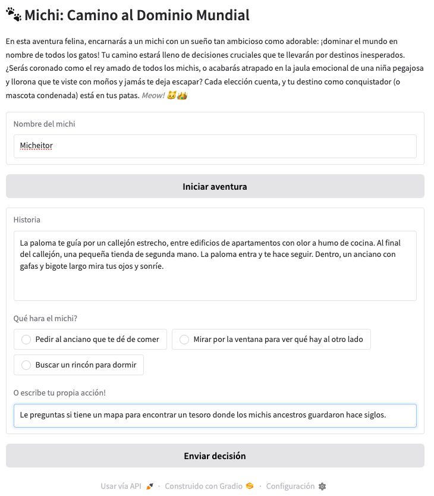

## 🐱 **“Michi: Camino al Dominio Mundial”**

### 🎮 Concepto General

Eres un michi callejero con un gran objetivo: conquistar el mundo. Porque los michis siempre han estado destinados a dominar el mundo. Pero primero debes sobrevivir al vecindario, reunir aliados (otros gatos, palomas, perros despistados), encontrar comida, hackear el router de los humanos, y más. Cada decisión afecta tu historia y destino.

---

### 🧪 Estilo del Storytelling

- **Humor absurdo**: referencias a internet, memes de gatos, drama exagerado.
- **Decisiones ridículas pero con consecuencias**: "¿Maullar diplomáticamente o lanzar un bollo de pelo?"

---

### 🧩 Ideas de desarrollo

#### Endpoints principales

- `POST /start`: Comienza una nueva aventura.
- `POST /decision/{story_id}`: Envía una decisión y continúa la historia.
- `GET /choices/{story_id}`: Obtén las opciones disponibles.
- `GET /stats/{story_id}`: Consulta el estado del michi (energía, reputación, aliados).
- `GET /story/{story_id}`: Consulta el progreso de la historia.
- `POST /reset/{story_id}`: Reinicia la historia.

---

### 🛠️ Posible Stack

- **Backend**: FastAPI.
- **Base de datos**: MongoDB.
- **Narrativa**: Hugging Face Transformers.
- **Frontend (opcional)**: Gradio para probar la historia.

---

### 🧠 Modelos de Hugging Face Involucrados

- **Generación de narrativa humorística**:
  - `llama-2-7b-chat.Q4_K_M`
  - `tiiuae/falcon-7b-instruct`
  - `mistralai/Mistral-7B-Instruct-v0.2`
  - `gpt2`
  - `flan-t5` con prompts creativos.
- **Clasificador de tono o emoción (opcional)**: Para interpretar respuestas del jugador si se decide hacerlo más avanzado.

---

### 🐾 Ejemplo de Nodo Inicial

#### 🎬 NODO 1: El Despertar del Michi

**Narrativa:**

> Te despiertas dentro de una caja de cartón húmeda, justo al lado de una tienda de sushi cerrada. Llueve. Huele a desesperación y atún viejo.
> 
> Frente a ti, una paloma con parche en el ojo te mira fijamente. Podría ser una aliada... o una amenaza.
> 
> Tienes hambre. Tienes sueño. Tienes pelusa en el bigote. Pero algo en tu alma felina te dice: *"Has nacido para algo más grande."*

**Opciones:**

1. Maullar fuertemente para atraer humanos.
2. Seguir a la paloma misteriosa.
3. Comer un trozo de sushi sospechoso tirado en el suelo.

---

